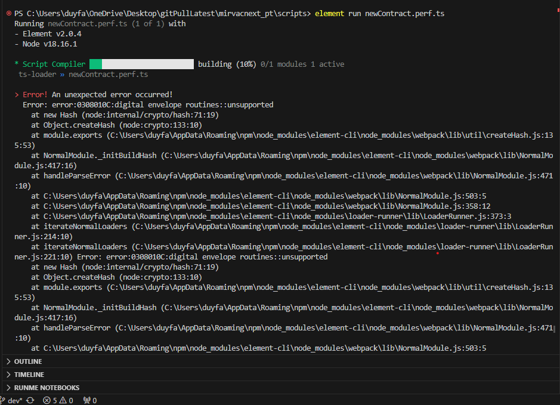

# mirvacnext_pt

This repository serves as the hub for Facto's performance testing project conducted for Mirvac. The primary aim was to evaluate the traffic handling capabilities of Mirvac's iTWOcx platform.

**Key Highlights:**

- **Problem Statement:** Mirvac required performance testing for critical 'must-have' scope items on the iTWOcx platform.

- **Our Role:** Facto provided automation and testing expertise to develop and execute performance test scripts.

- **Tool Utilized:** We leveraged Element, a powerful browser-based load testing tool, to simulate user interactions with the iTWOcx platform.

**Outcome:** This collaborative effort between Facto and Mirvac aims to ensure project deadlines are met and the iTWOcx platform's performance is optimized, ensuring an excellent user experience.

## Table Of Content

1. [Requirements](#requirements)
2. [Installation](#installation)
3. [Running Tests](#running-tests)
4. [Known Issues](#known-issues)

## Requirements

This framework requires the following:

- Git 
- Node.js
- Flood Element CLI

## Installation

### For Windows:

1. Download and install Git from [Git for Windows](https://gitforwindows.org/).
2. Download and install Node.js from [Node.js official website](https://nodejs.org/).
3. To install Element CLI on Windows, run the following command:

    ```bash
    npm -g install element-cli
    ```

### For macOS:

1. Download and install Git from [Git for macOS](https://gitforwindows.org/).
2. Download and install Node.js from [Node.js official website](https://nodejs.org/).
3. To install Element CLI on macOS, run the following command:

    ```bash 
    npm -g install element-cli
    ```

4. For a detailed list of commands and options in Element CLI, run:

    ```bash
    element help
    ```

5. After installing the prerequisites:
    - **Clone the Repository**: `git clone https://github.com/facto-tech/mirvacnext_pt.git`
    - **Navigate to the Directory**: `cd mirvacnext_pt`


## Running Tests

The test scripts are located in the `mirvacnext_pt\scripts` directory. To run the tests, follow these steps:

1. Navigate to the script directory:

    ```
    cd mirvacnext_pt\scripts
    ```

2. Execute the test script:

    ```
    element run my-element-test.ts
    ```

    This command runs the script headlessly for one iteration on your local machine. To view the browser interactions, use the `--no-headless` flag:

    ```
    element run my-element-test.ts --no-headless
    ```

### Configuration

Update the `element.config.js` file with the appropriate settings.

Place your test scripts in the `scripts` directory.

## Known Issues

### [Digital envelope routines::unsupported](https://stackoverflow.com/questions/69692842/error-message-error0308010cdigital-envelope-routinesunsupported)



If you encounter the following error after running the test for the first time:

> Error! An unexpected error occurred!

> Error: error:0308010C:digital envelope routines::unsupported

This is a known issue. You can resolve it using one of the following options:

**Option 1:** Downgrade to Node.js v16. Reinstall the current LTS version from Node.js' website or use a Node.js version manager like nvm (Windows: nvm-windows).

**Option 2:** Enable the legacy OpenSSL provider. Depending on your terminal:

- On Unix-like systems (Linux, macOS, Git bash, etc.), run:

    ```shell
    export NODE_OPTIONS=--openssl-legacy-provider
    ```

- On Windows command prompt, run:

    ```shell
    set NODE_OPTIONS=--openssl-legacy-provider
    ```

- On PowerShell, run:

    ```shell
    $env:NODE_OPTIONS = "--openssl-legacy-provider"
    ```

After selecting the preferred option (we recommend option 2), run the test again to ensure it works as expected.
